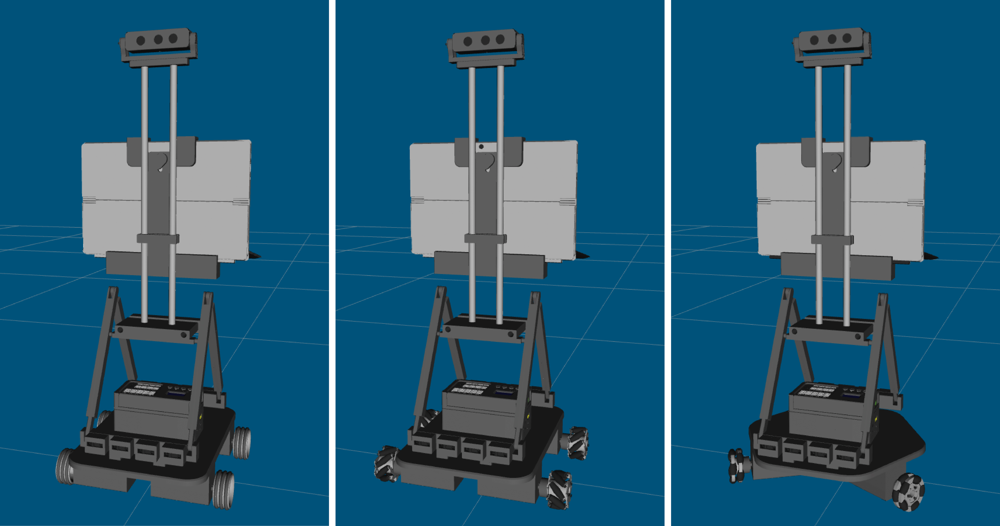
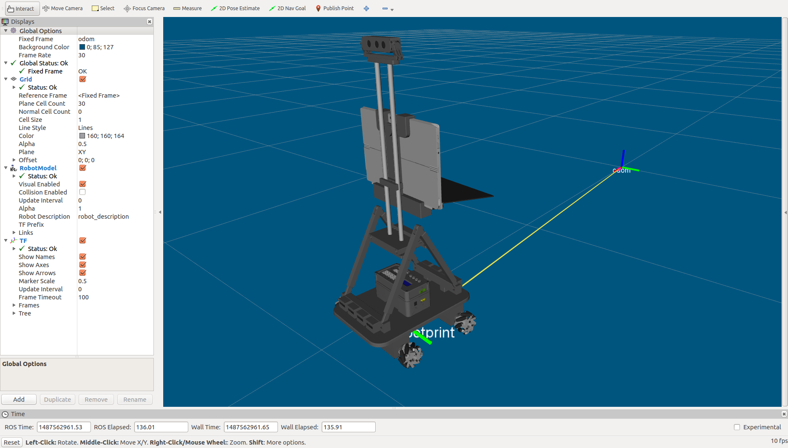
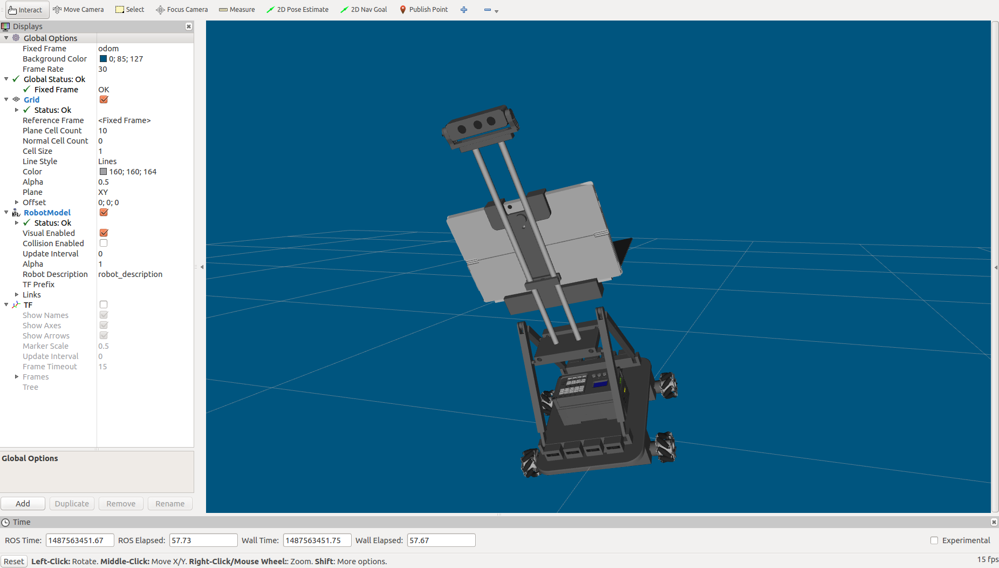
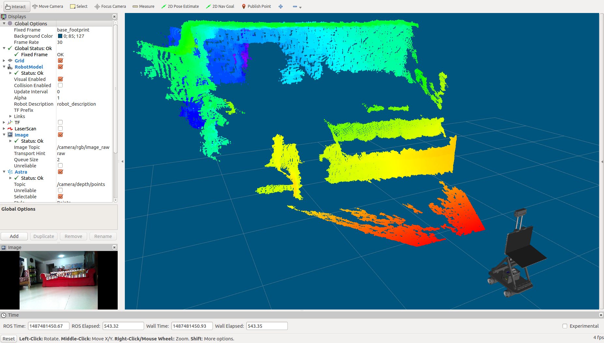
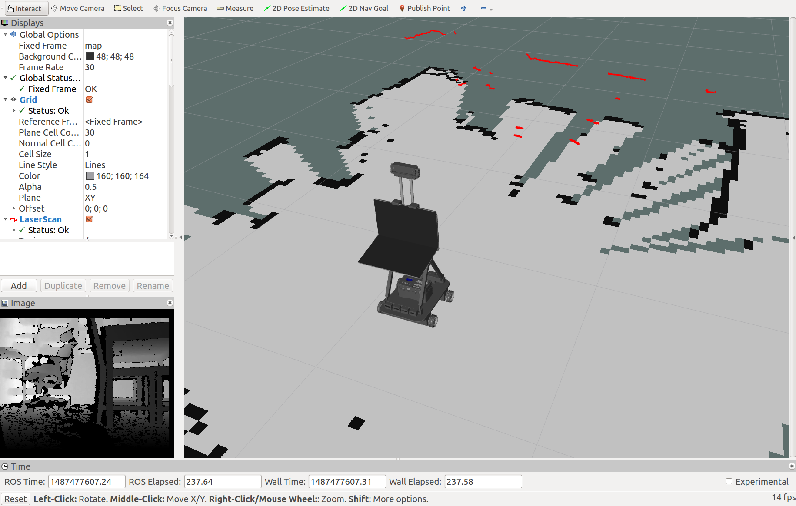
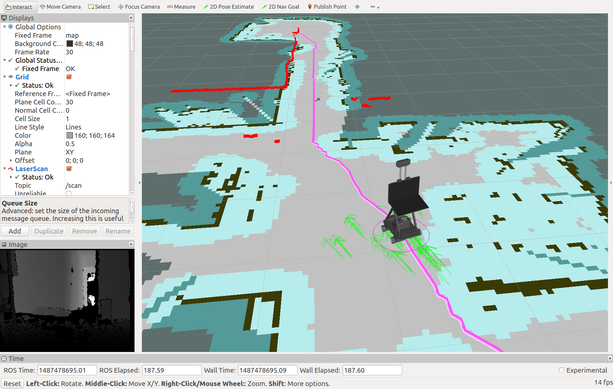

# 启智CV开放源码

## 使用步骤

1. 安装ROS(melodic/Ubuntu 18.04). [安装步骤](http://wiki.ros.org/melodic/Installation/Ubuntu)
2. 配置好开发环境. [配置方法](http://wiki.ros.org/ROS/Tutorials/InstallingandConfiguringROSEnvironment)
3. 安装依赖项:
```
sudo apt-get install ros-melodic-joy
sudo apt-get install ros-melodic-hector-mapping
sudo apt-get install ros-melodic-gmapping
sudo apt-get install ros-melodic-navigation
sudo apt-get install ros-melodic-sound-play
sudo apt-get install ros-melodic-astra-camera
sudo apt-get install ros-melodic-astra-launch
sudo apt-get install ros-melodic-depthimage-to-laserscan
sudo apt-get install ros-melodic-libuvc
```
4. 获取源码:
```
cd ~/catkin_ws/src/
git clone https://github.com/6-robot/wpb_cv.git
git clone https://github.com/orbbec/ros_astra_camera.git
git clone https://github.com/orbbec/ros_astra_launch.git
```
5. 设置设备权限
```
roscd wpb_cv_bringup
cd scripts
chmod +x create_udev_rules.sh
./create_udev_rules.sh 
```
6. 编译
```
cd ~/catkin_ws
catkin_make
```
7. 欢迎享用 :)

## 平台介绍
启智CV是[北京六部工坊科技有限公司](http://www.6-robot.com)推出的一款侧重机器人软件算法学习的机器人模块化套件。和启智标准版一样，启智CV采用免螺丝的独特装配方式，缩短装配操作环节。在有限的实验课时里，可以快速搭建起机器人硬件本体，从而能将主要精力集中于ROS软件开发和机器人视觉算法的实践学习。

## 功能特性

### 1. URDF模型描述
启智CV版运行ROS操作系统，三种底盘构型都具备完整的URDF模型描述，可以在ROS系统里直接加载和扩展。


### 2. 里程计
启智CV版装备了带编码器的直流伺服电机，可以在ROS里获取电机码盘计数，从而推算出机器人的移动里程信息。


### 3. IMU姿态传感
启智CV版内置了一枚六轴的IMU单元，可以在ROS中实时获取机器人的滚转、倾斜和朝向信息，为上层控制算法提供数值依据。


### 4. 三维立体视觉
启智CV版装备了RGBD立体相机，能够探测视野范围内的立体信息并实时生成三维点云。


### 5. SLAM环境健图
启智CV版使用DepthToScan技术将三维立体点云进行降维SLAM，从而构建出可以进行定位导航的二维平面地图。


### 6. 自主定位导航
启智CV版将传感器获取的三维点云信息与电机里程计数据进行融合，在构建好的地图里进行定位和自主导航。


